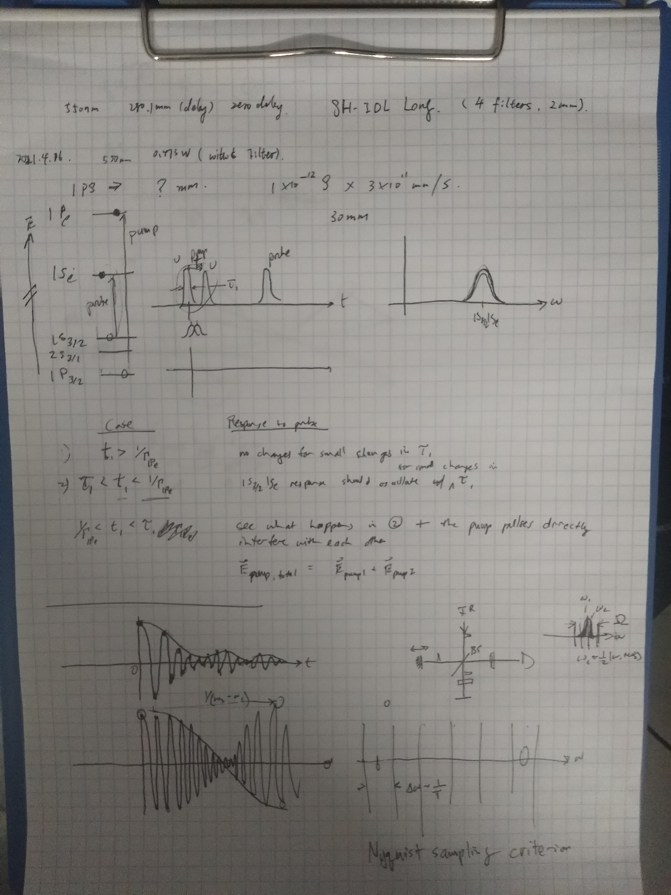

# 2021 年 4 月 16 日
# 上午

因为改变了工作波长，由于 AOM 中光栅面并非完全平行于转轴，故相应调节光栅后 AOM 的效率有所下降，但依然可用

以 20 fs 为步长，从 0 到 980 fs 扫描两个 pump pulse 间的时延，并且相邻两组 pump 光之间有 $\pi$ 的相位差，得到有两个对角峰、两个非对角峰的 2D 光谱. 但是 probe 的 1S(e) -  1S_{3/2}(h) 波长处的两个信号峰随着 pump 波长的改变有略微的振荡，原因不明

光谱分析：
(1) 当两个 pump pulse 间的时延 $t_1$ 大于 1P(e) 能级的寿命 $1/\Gamma_{1P(e)}$ 时，$t_1$ 的微小改变并不影响信号强度；
(2) 当 $\tau_1<t_1<1/\Gamma_{1P(e)}$（$\tau_1$ 为单个 pump pulse 的时长），1S_{3/2}(h) - 1S(e) 的 resonace 将会随着 $t_1$ 的微小改变而振荡；
(3) 当 $1/\Gamma_{1Pe}<t_1<\tau_1$ 时，一方面，后一 pump pulse 的和前一 pump pulse 在时间上未重叠的部分会产生和 (2) 中类似的振荡效果，另一方面，两个 pump pulse 在时间上重叠的部分会发生干涉，这一部分的强度也会随着 $t_1$ 的改变而振荡.

John 还提到了 Nyquist 采样准则：如果事先知道叠加产生干涉的两个频率的大致范围（带限），可以根据干涉所得波包的频率加上整数倍的采样频率推得参与干涉的两个频率，但是如何在光谱分析中利用这一规律未能很好理解

### Summary：得到了第一个 2D 光谱，但是probe 的 1S(e) -  1S_{3/2}(h) 波长处的两个信号峰随着 pump 波长的振荡无法解释

### TODO：阅读 John 所发文献

## 下午

调节 OPA，改善了用于瞬态光栅的激光输出功率，但是没有使其恢复到期望值