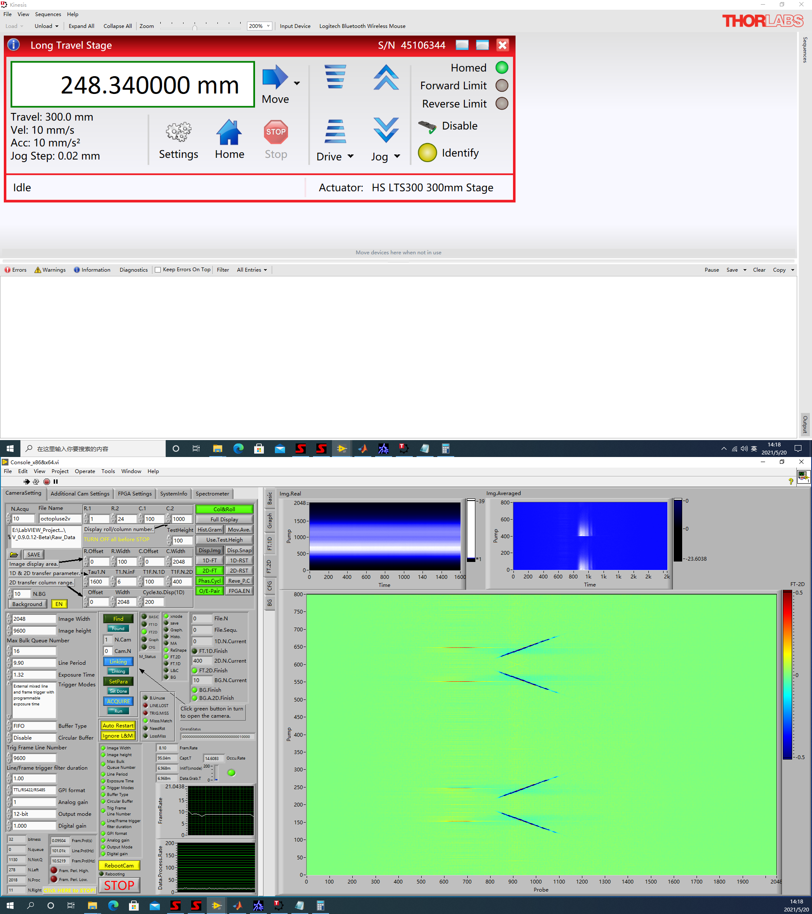
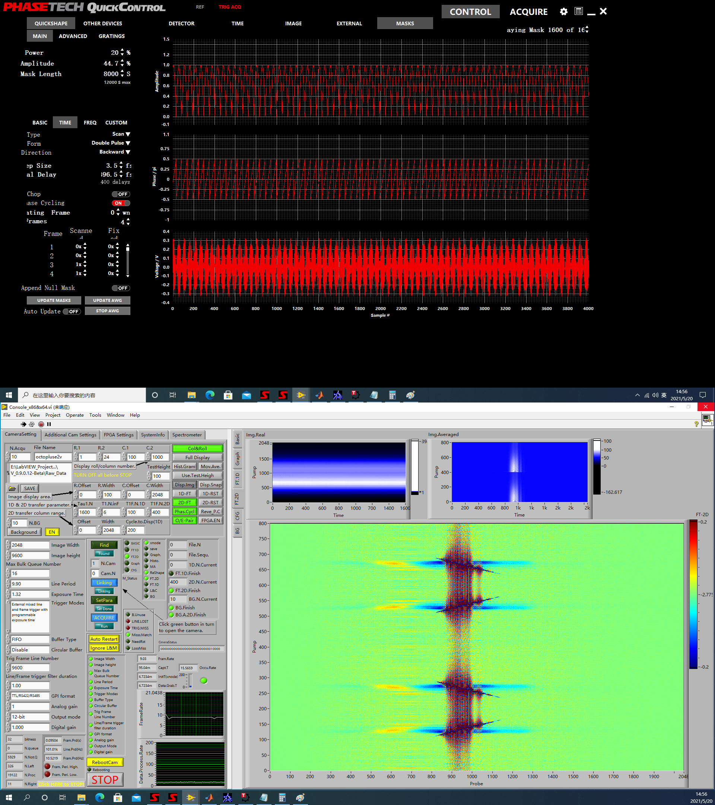

# 2021 年 5 月 20 日
两个 pump 光之间的相干特征长度即其波长，换算成特征的时延~ 600 nm / 3e8 (m/s) ~ 2 fs，而 AOM step size: 5.5 fs 大于该值. 在这一步长下，2D 光谱的 pump 轴方向存在欠采样，但可用采样定理反推真实频率.

观察到 CdSe 样品的 2D 光谱，但不确定对角峰是否是人为因素造成，故换用 Cd_{1-x}Mn_xSe 样品，未发现有非对角处的信号，故 CdSe 样品的图像可靠.

对角峰处存在的竖线主要来源于 AOM 内部的干涉.

激光源输出 1030 nm 的光经过 YAG 晶体后变为主要能量集中于 540 nm - 700 nm 频谱范围内的白光.

与线扫描相机搭配使用的单色仪，学名为 Computed tomography imaging spectrometer（存疑），可根据其原理推算线扫描相机的像素所对应的波长，进而得到其 2D 光谱的原点.