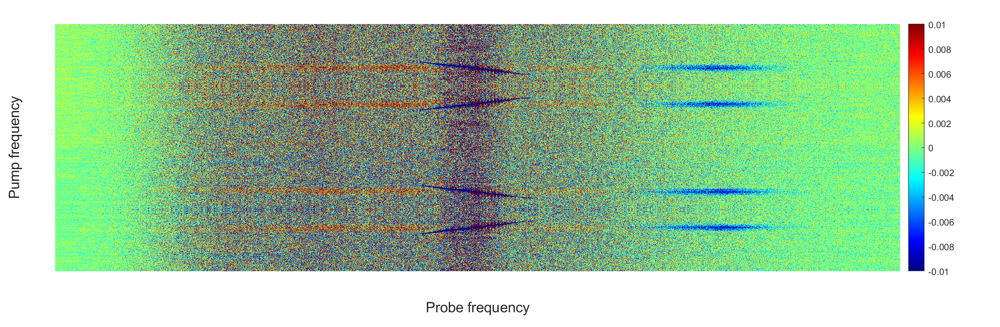

# 2021 年 5 月 26 日
## 上午
John 拿到了王晴宇的钙钛矿样品的吸收谱.

>This is the absorption spectrum of a thicker sample of the same material that Dr. Meng gave us yesterday. The basic features should be the same. There is a peak at 646 nm, so quite close to where we are already tuned. I would suggest first making a small adjustment to the OPA output and SHG crystal angle to tune the pump peak to about 646 nm and then try the same sequence of measurements that we performed on the quantum dots:
>1. TA trace to confirm zero delay (it will be a bit different for this sample given that coming in on the substrate-free side will entail a small change in zero delay);
>2. 2-point postive- and negative-delay scans (really 3-point so that we get 2 negative-delays and just use the second negative delay so as to avoid artifacts associated with the first negative delay) to establish that we are in a regime of linear response.
>3. Full TA scan. Here we should do a scan at relatively high pump fluence that is in the linear response range and then do one at 10x lower pump power. The reason for this is that these systems are confined in only 1 direction, so the dynamics may be different than I am used to with quantum dots. We want to make sure that we are not missing anything and that the dynamics really have the same shape at moderate and low fluences. 
>4. 2D spectra.

> We need to be a bit more careful with our pump intensities. When we excite quantum dots in solution with 1 exciton per quantum dot, the average density of the energy dumped into the system is not so high. It is high in the individual quantum dot, but the quantum dots only occupy a small fraction of the total volume. Now, it is like taking all the quantum dots and evaporating the solvent so as to leave a dense film of quantum dots. Within the individual dots, the excitation density may be unchanged, but that energy turns into heat (or emitted photons). In the case of the film, if there is one excitation per exciton volume, then there is a large energy density that has nowhere to difuse except at the edges of the excitation spot and the film/substrate interface. That is unlike the case of dots in solution in which the dot may have a lot of excess energy, but this can be dissipated into the solvent. In short, heating-related damage can be a bigger issue in films.
——John

钙钛矿样品带隙对应波长为 646 nm，我们需要将 pump 光调到 646 nm，校准 OPA 和 BBO 后，用其重复对 CdSe 量子点的测量流程，以确保其工作正常.

## 下午
pump 光输出功率下降至 310 mW（昨天仍有 478 mW），调节 OPA 输出至 1292 nm，经过 BBO 后中心波长不在 646 nm，需要进一步检测是 BBO 的问题还是 OPA 输出的问题.
>We have some problem in change the pump wavelength. The OPA output is 310mW (478mW in yesterday), and when I change the OPA to 1292nm (2*646), the output through going to ~210mw after adjust BBO. Also we cannot reach SHG wavelength as we want, the output cannot make the half-maximum cover 640nm (OPA 1280nm) or 646nm (OPA 1292nm). 
*The 1/3 laser output is ~14.1W.
I want to know if I can remove the BBO and check OPA output driectly.
——梁超逸

## 晚上
John 调整了 OPA 中有缺陷的反射镜（该反射镜表面此前被清洁过，清洁过程中留下了缺陷，在激光的照射下，缺陷不断恶化），激光输出功率改善.

换用钙钛矿样品，钙钛矿样品散热性能不如量子点胶体，故当用 20% 的 RF Power 进行一次 TA 谱测量确定零时延位置后，就不再能得到 TA 谱信号了，估计是激光强度过高，打坏了样品. 换用样品上另一个位点，无信号；改用更小的 RF Power，仍然无信号；更换样品位点，并且改用更小的 RF Power，并且将样品前移，使得 pump 光在样品上的光斑更大，能量更分散，得到信号. 钙钛矿的信号强度远不如量子点胶体. 对于量子点胶体，经 pump 光激发之后，probe 光的透射强度是增强的，但对于钙钛矿却是减弱的，John 和梁超逸解释了原因，但未完全理解.

测量了钙钛矿的 2D 光谱，得到的信号峰比量子点的更为丰富.
